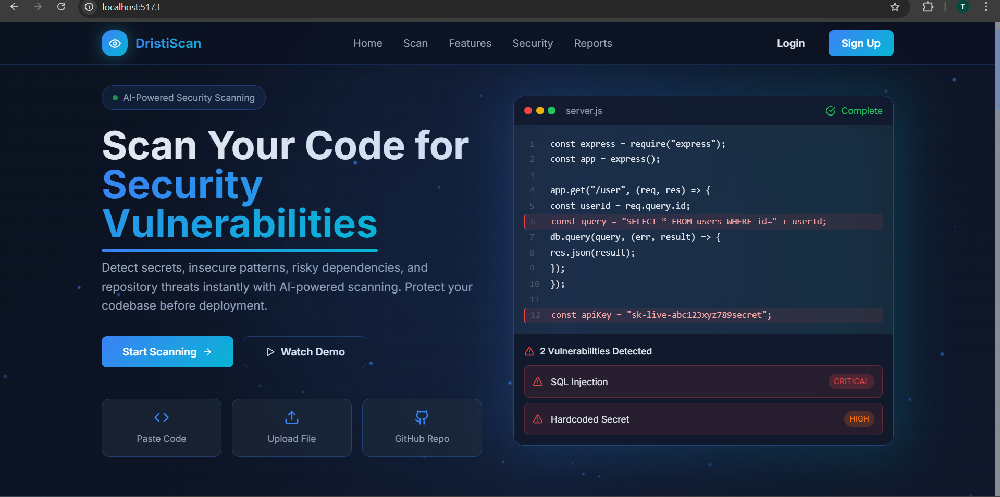
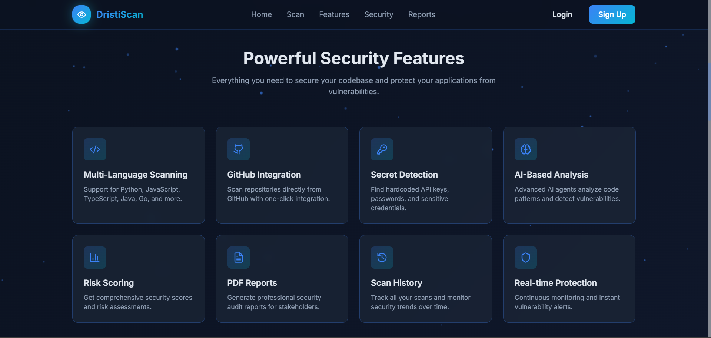
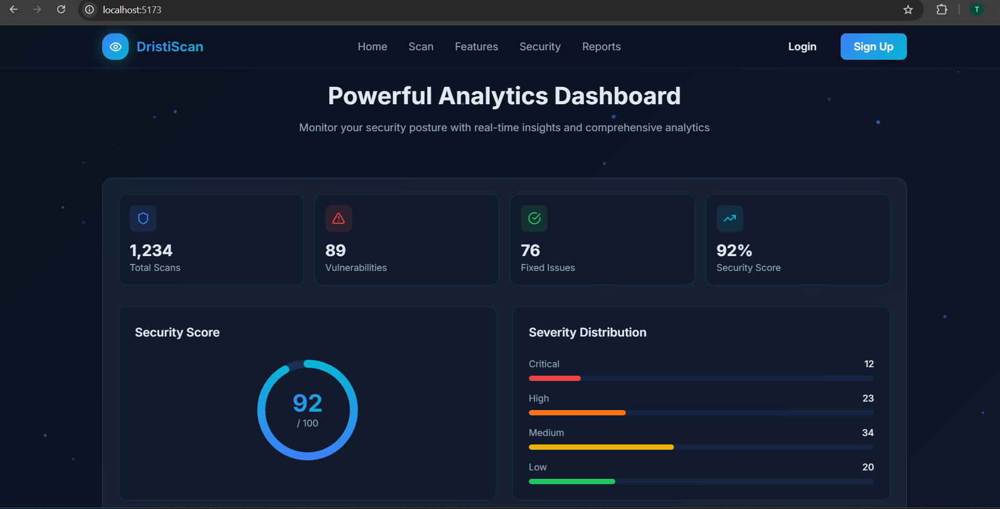
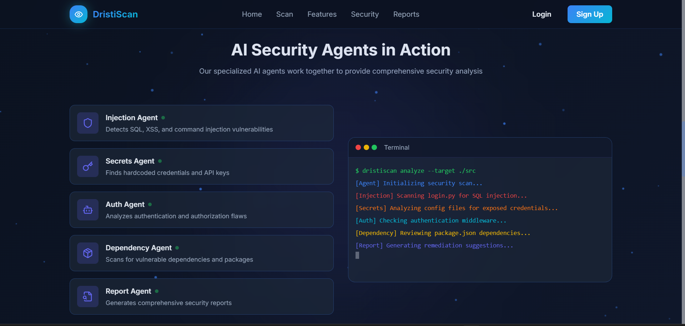

<p align="center">
  <b>DristiScan Frontend — AI Security Dashboard</b>
</p>

<p align="center">
  
  
  
  
  
  
</p>

---

## 🚀 Overview

The DristiScan Frontend is a modern, responsive **security intelligence dashboard** built using React + Vite.

It provides a clean and interactive interface for:

* Viewing scan results
* Understanding vulnerabilities
* Accessing AI-powered explanations
* Exploring remediation steps

---

## 🖼️ Landing Screens

<p align="center">
  
</p>

<p align="center">
  
</p>

<p align="center">
  
</p>

<p align="center">
  
</p>

---

## 🧠 Key Features

### 🔍 Security Dashboard

* Visual representation of vulnerabilities
* Severity-based classification
* Clean card-based UI

### 🤖 AI Insights (RAG Integration)

* Explain vulnerability
* Suggest secure fixes
* Show references (OWASP, CWE, CVE)
* Context-aware explanations

### 📊 Reports & Analytics

* Scan history tracking
* Detailed vulnerability view
* PDF report access

### 🎨 UI/UX

* Modern dark theme (futuristic design)
* Smooth animations (Framer Motion)
* Responsive layout

---

## 🏗️ Frontend Architecture

```plaintext id="1u2y1y"
             User Interaction
                   ↓
        React Components (Pages + Cards)
                    ↓
           API Layer (Axios / Fetch)
                    ↓
               FastAPI Backend
                    ↓
             Scanner + RAG Engine
                     ↓
            Response → UI Rendering
```

---

## 📂 Project Structure

```bash id="8h9s0d"
frontend/
  src/
    pages/
      Dashboard.jsx
      ScanPage.jsx
      ReportPage.jsx
    components/
      Navbar.jsx
      Sidebar.jsx
      VulnerabilityCard.jsx
      AIInsightsPanel.jsx
    services/
      api.js
    styles/
      tailwind.css
```

---

## ⚙️ Setup & Run

### Install dependencies

```bash id="phs4fr"
npm install
```

### Start development server

```bash id="zj8z9x"
npm run dev
```

Frontend runs on:
👉 http://localhost:5173

---

## 🔌 API Integration

Frontend connects to backend APIs:

* `POST /scan/code`
* `POST /scan/upload`
* `GET /reports/{id}`
* `POST /rag/explain`
* `POST /rag/fix`

---

## 🧠 AI Interaction Flow

```plaintext id="u5s7w3"
            User clicks "Explain"
                    ↓
         Frontend calls /rag/explain
                    ↓
        Backend RAG retrieves knowledge
                    ↓
          LLM generates explanation
                   ↓
         UI displays explanation + fix + references
```

---

## 🎨 UI Components

### 🔹 Vulnerability Card

* Shows issue title
* Severity badge
* Quick actions (Explain / Fix)

### 🔹 AI Insights Panel

* Explanation
* Impact
* Fix recommendation
* Secure code example
* References

---

## 🚀 Build for Production

```bash id="c3m2dn"
npm run build
```

---

## 🔐 Environment Configuration

Create `.env` file:

```bash id="l1k8w2"
VITE_API_URL=http://localhost:8000
```

---

## 🧪 Example Flow

1. Upload code / scan repository
2. View detected vulnerabilities
3. Click **"Explain"**
4. See AI-generated insights
5. Apply suggested fix

---

## 🔮 Future Enhancements

* Real-time scanning UI
* AI chat assistant
* Visual threat graphs
* Multi-project dashboard

---

## 👩‍💻 Frontend Role

The frontend acts as the **visual intelligence layer** of DristiScan:

* Converts raw findings → understandable insights
* Provides AI-powered assistance
* Enhances user decision-making

---
